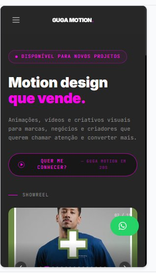

# 🎬 Guga Motion - Portfolio

Portfolio profissional de **Gustavo Leão**, motion designer especializado em animações e vídeos que vendem.



## 🚀 **Como rodar o projeto**

### **1. Clone este repositório**
```bash
git clone [URL-DO-SEU-REPO]
cd guga-motion-portfolio
```

### **2. Instale as dependências**
```bash
npm install
```

### **3. Rode localmente**
```bash
npm run dev
```

O site vai abrir em `http://localhost:5173`

---

## 📦 **Deploy na Vercel (RECOMENDADO)**

### **Opção A: Deploy automático via GitHub**
1. Crie conta no [Vercel](https://vercel.com)
2. Conecte seu GitHub
3. Clique em **"New Project"**
4. Selecione este repositório
5. Clique em **"Deploy"**

✅ Pronto! Seu site está no ar.

### **Opção B: Deploy via CLI**
```bash
npm install -g vercel
vercel login
vercel
```

---

## 🌐 **Conectar seu domínio da Hostinger**

1. Na Vercel, vá em **Settings → Domains**
2. Adicione seu domínio (ex: `gugamotion.com.br`)
3. A Vercel vai te dar os **nameservers**
4. Na Hostinger, vá em **Domínios → DNS**
5. Cole os nameservers da Vercel
6. Aguarde 24-48h para propagar

---

## 🎨 **Personalizar o site**

### **📹 Trocar os vídeos do showreel**

Abra: `src/components/home/ShowreelSection.jsx`

```javascript
const VIDEOS = [
  'URL_DO_SEU_VIDEO_1.mp4',
  'URL_DO_SEU_VIDEO_2.mp4',
  // ... adicione mais
];
```

**Opções para hospedar vídeos:**
- **Vimeo** (recomendado): Suba no Vimeo e use o link embed
- **YouTube**: Use o link embed do YouTube
- **Cloudflare Stream**: $5/mês, profissional

### **🔗 Adicionar suas redes sociais**

Abra: `src/components/layout/Navbar.jsx` e `Footer.jsx`

Procure por:
```javascript
const SOCIALS = [
  { name: 'Behance', Icon: BehanceIcon, url: '#' }, // ← Cole seu link aqui
  { name: 'Instagram', Icon: InstagramIcon, url: '#' },
  { name: 'LinkedIn', Icon: LinkedInIcon, url: '#' }
];
```

Troque `'#'` pelos seus links.

### **📱 Trocar número do WhatsApp**

Procure por `5562998744360` em todos os arquivos e troque pelo seu número.

Arquivos principais:
- `src/components/home/CTASection.jsx`
- `src/components/home/GugaOverlay.jsx`
- `src/components/layout/WhatsAppFAB.jsx`
- `src/pages/About.jsx`
- `src/pages/Contact.jsx`

### **🎨 Mudar cores**

Abra: `src/index.css`

```css
--primary: 305 100% 50%;  /* Rosa neon #FF00FF - Mude aqui! */
--background: 0 0% 5%;     /* Preto escuro */
```

Use [este conversor HSL](https://hslpicker.com/) pra escolher novas cores.

---

## 📂 **Estrutura do projeto**

```
guga-motion-portfolio/
├── src/
│   ├── components/
│   │   ├── home/           # Seções da página inicial
│   │   └── layout/         # Header, Footer, FAB
│   ├── pages/              # Home, About, Contact
│   ├── lib/                # LanguageContext (PT/EN)
│   ├── App.jsx             # Rotas principais
│   ├── main.jsx            # Ponto de entrada
│   └── index.css           # Tema e cores
├── index.html
├── package.json
├── vite.config.js
└── tailwind.config.js
```

---

## ⚠️ **URLs dos vídeos (importante!)**

Os vídeos atualmente estão hospedados no CDN do Base44:
```
https://media.base44.com/videos/public/...
```

**Eles vão funcionar enquanto:**
- Sua conta no Base44 existir
- Você não deletar os arquivos de lá

**Recomendação:** Migre pros vídeos pro **Vimeo** quando tiver tempo:
1. Crie conta no [Vimeo](https://vimeo.com)
2. Faça upload dos 15 vídeos
3. Pegue os links de cada um
4. Cole no `ShowreelSection.jsx`

---

## 🛠️ **Comandos úteis**

```bash
npm run dev       # Roda local
npm run build     # Cria build de produção
npm run preview   # Testa o build antes de subir
```

---

## 📧 **Suporte**

Dúvidas? Me chama no WhatsApp: **+55 62 99874-4360**

---

## 🎉 **Créditos**

- **Design & Desenvolvimento:** Gustavo Leão
- **Stack:** React + Vite + Tailwind CSS + Framer Motion
- **Hospedagem:** Vercel

---

**Feito com 💜 e muito motion design**
